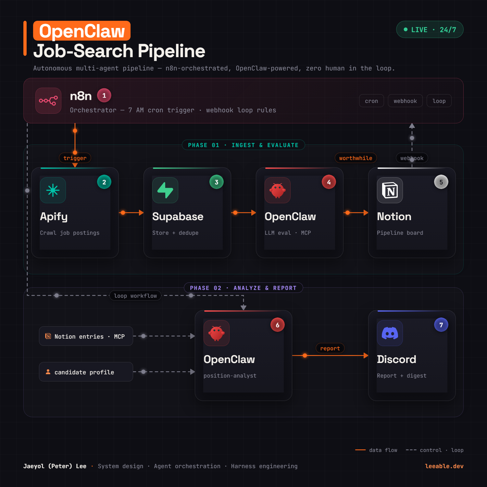
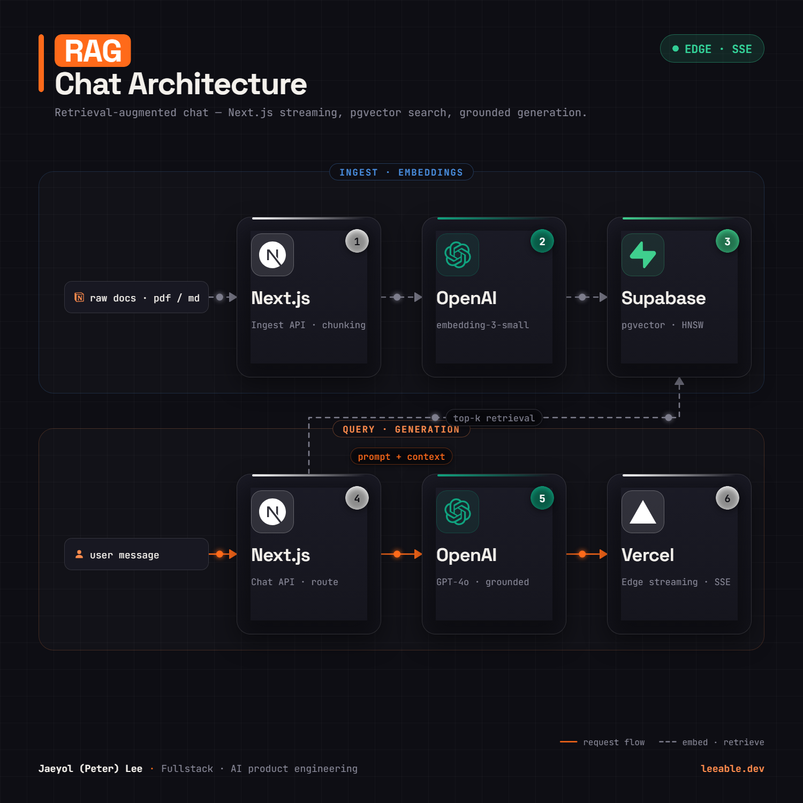

# Workflow Diagram Generator

**Describe a diagram in plain language → AI writes a declarative spec → preview live in the browser → download a publication-ready PNG or animated GIF.**

A local-first, AI-driven alternative to dragging boxes around in Figma or draw.io. Instead of hand-placing shapes, diagrams are authored as small JavaScript spec files that a rendering engine turns into polished, square (1500×1500) architecture diagrams — with brand logos, numbered steps, phase zones, and animated data-flow dots.

<p align="center">
  
</p>

<p align="center">
  <a href="docs/openclaw-job-search-pipeline.gif">▶ View the animated GIF export</a> · seamless 30-frame loop, generated entirely in the browser
</p>

## Why

Diagramming tools optimize for manual editing. When an AI assistant is doing the drawing, what you actually need is:

1. a **declarative format** the AI can write and revise reliably,
2. a **renderer** that makes every output look professionally designed by default,
3. **pixel-perfect exports** (PNG + looping GIF) at a fixed social-friendly square size.

This project is that wrapper. You chat with an AI coding assistant (e.g. Claude Code) in this repo, ask for a diagram, and review the result at `localhost:5173` — then export.

## Features

- **Declarative diagram specs** — nodes, zones, wires, labels, chips as plain data (`diagrams/*.js`)
- **Auto-discovery + in-app selector** — drop a spec in `diagrams/`, it appears in the dropdown; selection syncs to `?d=` URL param
- **Design system out of the box** — dark theme, numbered step badges, phase zones, brand-colored cards, filled arrowheads, wire legend
- **Real brand logos** — [simple-icons](https://github.com/simple-icons/simple-icons) registry (3,000+ brands) plus custom multi-color SVG support with automatic id scoping
- **Animated flow** — dots travel along SVG wire paths via `requestAnimationFrame`
- **Three export formats** — full-res PNG, optimized GIF, and a frame-accurate H.264 **MP4** (WebCodecs) that's tiny and animates on LinkedIn
- **Fast exports** — the static frame is captured once with html2canvas, then animation frames are composed natively on canvas (~30× faster than per-frame DOM capture); seamless loop
- **Headless verification** — `npm run shot` screenshots any diagram for the AI's self-review loop

## Quick start

```bash
npm install
npm run dev          # http://localhost:5173
```

Pick a diagram from the dropdown, then **▶ Record MP4**, **● Record GIF**, or **⬇ Download PNG**.

### Posting to LinkedIn / social

| Goal | Format | Size | Notes |
| --- | --- | --- | --- |
| **Animated post** | **MP4** | 1080² · ~0.7 MB | Best everywhere. LinkedIn flattens uploaded GIFs to a still — upload the MP4 as video so it actually moves. |
| Static post | PNG | 1500² · ~0.6 MB | LinkedIn displays square images up to 1200px and downscales cleanly, so the crisp 1500² master is ideal. |
| Quick share (Slack/web) | GIF | 800² · ~3.5 MB | Convenient inline preview; far larger than MP4 for the same content. |

Export sizes are tunable in [`src/engine/constants.js`](src/engine/constants.js) (`MP4_SIZE`, `GIF_SIZE`, frames, bitrate). MP4 export needs a Chromium-based browser (WebCodecs); the button hides automatically otherwise.

```bash
# optional: headless screenshot verification (used by the AI authoring loop)
npx playwright install chromium
npm run shot -- rag-chat-architecture
```

## Authoring with AI

This repo is designed to be driven by an AI coding assistant. `CLAUDE.md` points the assistant at [`diagrams/INSTRUCTIONS.md`](diagrams/INSTRUCTIONS.md) — a complete authoring guide covering the spec format, coordinate system, icon registry, color rules, and layout/anti-overlap rules.

A typical session:

> "Make me an architecture diagram of my payment service: API gateway → auth → orders → Stripe, with a webhook loop back, dark theme, two phases."

The assistant writes `diagrams/payment-service.js`, verifies it headlessly with `npm run shot`, and the diagram appears in the selector — ready to export.

### Spec format (abridged)

```js
export default {
  meta:   { slug, titleHl, titleRest, subtitle, live, legend, footerName, footerRole, brand },
  zones:  [{ label: 'PHASE 01 · INGEST', color: '#00C2A8', x, y, w, h }],
  hub:    { icon: 'n8n', color: '#EA4B71', name, step, sub, tags, x, y, w, h },
  nodes:  [{ step: '2', name: 'Supabase', sub: 'Store + dedupe', icon: 'supabase', color: '#3FCF8E', x, y, w, h }],
  chips:  [{ id, t: 'candidate profile', icon: 'profile', x, y, w, h }],
  wires:  [{ id, d: 'M366 655 L442 655', dir: 'right', hx: 442, hy: 655, color: '#ff6a1a', dots: 1 }],
  labels: [{ t: 'trigger', x, y, color: '#ff6a1a' }],
}
```

See the full reference in [`diagrams/INSTRUCTIONS.md`](diagrams/INSTRUCTIONS.md).

## Examples

| `openclaw-job-search-pipeline` | `rag-chat-architecture` |
| --- | --- |
|  |  |

## Architecture

```
index.html
src/
  main.js              app shell — diagram discovery (import.meta.glob), selector, export buttons
  style.css            design system (dark theme, cards, badges, zones, chips)
  engine/
    constants.js       canvas size (1500²), GIF loop settings
    icons.js           icon registry — simple-icons paths + custom raw SVG with id scoping
    markup.js          pure HTML/SVG string builders for every primitive
    flow.js            FlowController — animated dots, phase sampling for exports
    exporter.js        capture-once + compose-per-frame PNG/GIF pipeline
    render.js          mounts a spec, returns { exportPNG, recordGIF, dispose }
diagrams/
  *.js                 diagram specs (auto-discovered)
  INSTRUCTIONS.md      authoring guide for AI assistants
scripts/
  screenshot.mjs       headless frame screenshot for the verification loop
```

**Export pipeline.** html2canvas cannot capture CSS animations, and a 1500×1500 DOM capture costs ~0.5–1s. So the exporter hides the dot layer, captures the static frame **once**, then composes every animation frame natively (base bitmap + glowing dots sampled along the wire paths at phase `i/N`). One DOM capture per export instead of one per frame — and the loop is mathematically seamless. PNG exports at full 1500²; the GIF is downscaled (`GIF_SIZE`, 256-color/LZW makes its size scale with pixel count); the MP4 is encoded frame-by-frame with the WebCodecs `VideoEncoder` (H.264) and muxed in-memory — high quality at a fraction of the GIF's bytes.

**Your own diagrams stay local.** `diagrams/*.js` is gitignored except the two bundled examples, so specs you author aren't committed unless you opt in by whitelisting them in `.gitignore`.

## Tech

Vanilla JS + [Vite](https://vitejs.dev) · [html2canvas](https://html2canvas.hertzen.com) · [gif.js](https://jnordberg.github.io/gif.js/) · [WebCodecs](https://developer.mozilla.org/docs/Web/API/WebCodecs_API) + [mp4-muxer](https://github.com/Vanilagy/mp4-muxer) · [simple-icons](https://simpleicons.org) · [Playwright](https://playwright.dev) (verification)

No framework, no backend — everything runs client-side.

## Roadmap

- [ ] In-browser AI authoring (chat → spec, no editor round-trip)
- [ ] More layout primitives (groups-within-groups, curved wires, swimlanes)
- [ ] Theme presets (light, blueprint, monochrome)
- [ ] SVG export

## License

[MIT](LICENSE) © [Jaeyol (Peter) Lee](https://github.com/yiwoduf)
